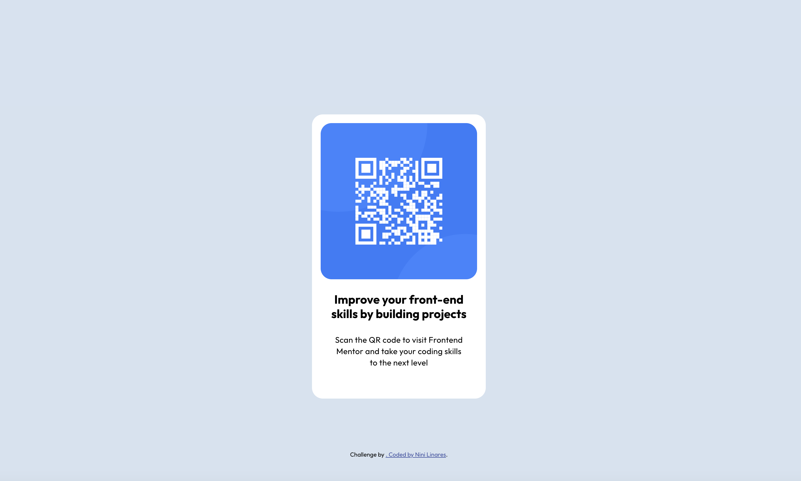

# Frontend Mentor - QR code component solution

This is a solution to the [QR code component challenge on Frontend Mentor](https://www.frontendmentor.io/challenges/qr-code-component-iux_sIO_H). Frontend Mentor challenges help you improve your coding skills by building realistic projects.

## Table of contents

-   [Overview](#overview)
    -   [Screenshot](#screenshot)
    -   [Links](#links)
-   [My process](#my-process)
    -   [Built with](#built-with)
    -   [What I learned](#what-i-learned)
    -   [Continued development](#continued-development)
-   [Author](#author)

**Note: Delete this note and update the table of contents based on what sections you keep.**

## Overview

### Screenshot



### Links

-   Solution URL: [(https://github.com/EnithLinares/qr-code-component.github.io]
-   Live Site URL: [https://enithlinares.github.io/qr-code-component.github.io/]

## My process

I gather my assets, fonts and design files and set up my partials for resets, typography and variables.
Visual chuncking before starting to code helps me structure the way I will do the classes for styling.
Lastly, I test the project in different screen sizing.

### Built with

-   Semantic HTML5 markup
-   CSS custom properties
-   Flexbox
-   Mobile-first workflow
-   For styles

### What I learned

I was reminded that I can make use of viewport hight for relative position of the cards so they always sit properly at the center of the page.

```css
.main {
    display: flex;
    justify-content: center;
    align-items: center;
    flex-direction: column;
    position: relative;
    padding: $sm-padding;
    background-color: $Slate-300;
} because of the use of custom variables
```

### Continued development

I want to keep learning how to better center components, and learning how to use grid for future projects.

## Author

-   Website - [Nini Linares](www.linkedin.com/in/enithlinares)
-   Frontend Mentor - [@EnithLinares](https://www.frontendmentor.io/profile/EnithLinares)
